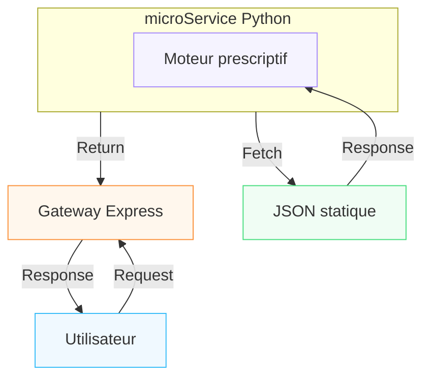
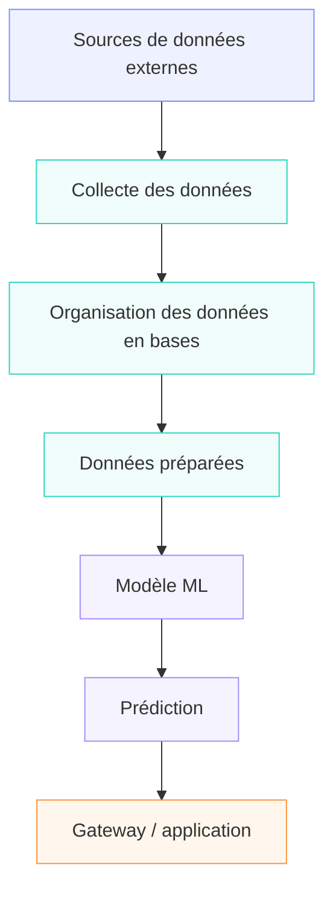
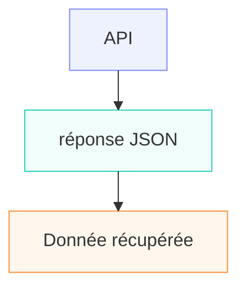

# Architecture et flux de données

Le projet EnergIA déploie actuellement un outil de simulation, selon un modèle prescriptif,  d'approvisionnement en électricité. 

## Schéma directeur du projet

à voir [en ligne](https://mermaid.ai/d/97290479-5b0d-4d02-acd2-0716ca182404 "C'est plus confortable")

```mermaid
---
config:
  layout: elk
---
flowchart LR
    Sources["Sources de données multiples"] --> JSON["JSON"]
    Sources --> CSV["CSV"]
    Sources --> Exceptional["Formats exceptionnels<br/>(XML, etc.)"]

    JSON -->|Batching| Batching["Batch"]
    CSV -->|Batching| Batching
    Exceptional -->|Batching| Batching

    Batching --> Validation["Validation du format"]
    Validation --> Conversion["Conversion vers un format unifié"]
    Conversion --> ETL["ETL Python"]

    ETL -->|stockage| TruthDB[("Base de vérité<br/>SQL")]
    ETL -->|stockage| DataLake[("Datalake")]
    ETL -->|stockage| AnalyticsDB[("Base analytique")]

    TruthDB --> Consistency["Contrôles de cohérence"]
    DataLake --> Consistency
    AnalyticsDB --> Consistency

    Consistency -->|données cohérentes| Enrichment["Enrichissement"]
    Consistency -->|écarts détectés| Reconciliation["Réconciliation<br/>et correction"]
    Reconciliation --> TruthDB
    Reconciliation --> DataLake
    Reconciliation --> AnalyticsDB

    APIs["APIs<br/>Données temps réel"] -->|flux temps réel| Enrichment
    APIs -->|fallback| TruthDB

    subgraph Training["Entraînement ML"]
        TrainingMS["Microservice<br/>d'entraînement ML"]
        MongoDB[("MongoDB")]
        ChromaDB[("ChromaDB<br/>Base vectorielle")]
        TrainingMS -->|lecture et persistance| MongoDB
        TrainingMS -->|recherche et stockage<br/>d'embeddings| ChromaDB

        ModelVersioning["Versionnement des modèles"]
        EmbeddingVersioning["Versionnement des embeddings"]
        ModelRegistry[("Registre des versions")]

        TrainingMS -->|modèle entraîné| ModelVersioning
        TrainingMS -->|embeddings générés| EmbeddingVersioning
        ModelVersioning --> ModelRegistry
        EmbeddingVersioning --> ModelRegistry

        ModelValidation["Validation du modèle"]
        ModelVersioning --> ModelValidation
    end

    TruthDB --> TrainingMS
    DataLake --> TrainingMS
    AnalyticsDB --> TrainingMS

    ModelValidation -->|modèle validé| MLModel["Modèle ML<br/>mis en production"]
    ModelValidation -->|modèle rejeté| TrainingMS

    Enrichment --> PredictionMS["Microservice<br/>de prédiction"]
    PredictionMS -->|requête| MLModel
    MLModel -->|prédiction| PredictionMS
    PredictionMS --> Gateway["Passerelle"]
    Gateway -->|réponse| Client["Client"]

    subgraph Monitoring["Supervision"]
        MonitoringService["Service de supervision"]
        MetricsStore[("Stockage des métriques pertinentes")]
        MonitoringService -->|métriques pertinentes| MetricsStore
    end

    Sources -.->|métriques| MonitoringService
    Batching -.->|métriques| MonitoringService
    Validation -.->|métriques| MonitoringService
    Conversion -.->|métriques| MonitoringService
    ETL -.->|métriques| MonitoringService
    TruthDB -.->|métriques| MonitoringService
    DataLake -.->|métriques| MonitoringService
    AnalyticsDB -.->|métriques| MonitoringService
    Consistency -.->|métriques| MonitoringService
    Reconciliation -.->|métriques| MonitoringService
    APIs -.->|métriques| MonitoringService
    Enrichment -.->|métriques| MonitoringService
    TrainingMS -.->|métriques| MonitoringService
    MongoDB -.->|métriques| MonitoringService
    ChromaDB -.->|métriques| MonitoringService
    ModelVersioning -.->|métriques| MonitoringService
    EmbeddingVersioning -.->|métriques| MonitoringService
    ModelRegistry -.->|métriques| MonitoringService
    ModelValidation -.->|métriques| MonitoringService
    MLModel -.->|métriques| MonitoringService
    PredictionMS -.->|métriques| MonitoringService
    Gateway -.->|métriques| MonitoringService

    classDef sourceStyle stroke:#818cf8,fill:#eef2ff
    classDef processStyle stroke:#2dd4bf,fill:#f0fdfa
    classDef validationStyle stroke:#facc15,fill:#fefce8
    classDef conversionStyle stroke:#38bdf8,fill:#f0f9ff
    classDef storageStyle stroke:#fb923c,fill:#fff7ed
    classDef controlStyle stroke:#e879f9,fill:#fdf4ff
    classDef correctionStyle stroke:#f87171,fill:#fef2f2
    classDef apiStyle stroke:#22d3ee,fill:#ecfeff
    classDef trainingStyle stroke:#a3e635,fill:#f7fee7
    classDef mlStyle stroke:#a78bfa,fill:#f5f3ff
    classDef clientStyle stroke:#4ade80,fill:#f0fdf4
    classDef monitoringStyle stroke:#fb7185,fill:#fff1f2
    classDef versionStyle stroke:#f97316,fill:#fff7ed

    class Sources,JSON,CSV,Exceptional sourceStyle
    class Batching,ETL,Enrichment,PredictionMS processStyle
    class Validation,ModelValidation validationStyle
    class Conversion conversionStyle
    class TruthDB,DataLake,AnalyticsDB,MongoDB,ChromaDB,MetricsStore,ModelRegistry storageStyle
    class Consistency controlStyle
    class Reconciliation correctionStyle
    class APIs,Gateway apiStyle
    class TrainingMS trainingStyle
    class MLModel mlStyle
    class Client clientStyle
    class MonitoringService monitoringStyle
    class ModelVersioning,EmbeddingVersioning versionStyle
```

## Objectif général du brief

Aujourd’hui, EnergIA ressemble à ça :

  
La limite de ce **moteur prescriptif** est que l'usage d'un fichier de données unique et statique est insuffisant pour **prédire** la consommation électrique. Il faut donc faire évoluer notre application.

Pour que l'application EnergIA reste maintenable et évolutive, il nous faut envisager le projet dans son ensemble avec une attention pour la donnée. C'est elle qui conditionne la qualité des prescriptions, des entraînements et des prédictions futures.

  
## Les étapes pour bien modéliser nos données et leurs flux

### ÉTAPE 1 / Choisir 4-6 variables
1. Temps
	heure
	jour de la semaine
	week-end
	mois
	saison
	vacances scolaires
	jours fériés

2. Météo
	température
	humidité
	ensoleillement
	précipitations
	vent

3. Type de journée
	jour ouvré
	week-end
	jour férié
	vacances

4. Région
	région
	population
	densité
	activité industrielle

5. Événements exceptionnels
	canicule
	grand froid
	événement sportif
	confinement, etc.

**Choisir les données utiles**

### ÉTAPE 2 / Trouver les vraies sources

Maintenant que nous avons identifier nos dimensions, nous devons identifier et vérifier une ou des sources de données fiables et alimentées _(tester la route d'API dans la barre d'adresse du navigateur si son accès est libre)_ et rassembler un certain nombres d'éléments les concernant. Il faudra documenter ces flux.

Exemple de tableau de sources :

| Donnée         | Source possible     | Format   | Fréquence  |
| -------------- | ------------------- | -------- | ---------- |
| Consommation   | RTE                 | CSV/API  | horaire    |
| Température    | API météo           | JSON     | horaire    |
| Ensoleillement | API météo           | JSON     | horaire    |
| Vacances       | API gouvernementale | JSON/CSV | ponctuel   |
| Jours fériés   | API calendrier      | JSON     | annuel     |
| Heure/jour     | calcul Python       | —        | temps réel |
Il nous faut identifier de vraies sources.

Il est indispensable, une fois une source donnée identifiée, de la tester afin d'identifier la réponse et son format :

Il nous faut maintenant identifier la façon dont nous allons récupérer les données et surtout la fréquence de ces récupérations.

### ÉTAPE 3 / Batch ou temps réel ?

**batch :** Les données sont récupérées à une fréquence déterminée et ,de préférence, de manière automatique, par lots.

  

RTE

 ↓

Script Python

 ↓

Récupération données

 ↓

Base de données

Exemple parfait :

historique de consommation

Tu n'as pas besoin de récupérer toute l'année de consommation à chaque prédiction.

---

## Streaming / temps réel

La donnée est récupérée au moment où elle est nécessaire.

Exemple :

Utilisateur demande une prédiction

          ↓

Gateway

          ↓

Python

          ↓

API météo

          ↓

Température actuelle

          ↓

Modèle ML

          ↓

Prédiction

La météo actuelle peut être récupérée en temps réel.

---

## Exemple de architecture

Vous pourriez avoir :

                   ┌──────────────┐

                    │     RTE      │

                    │ consommation │

                    └──────┬───────┘

                           │

                         BATCH

                           │

                           ↓

                    ┌──────────────┐

                    │    Base DB   │

                    └──────┬───────┘

                           │

                           │

┌──────────────┐           │

│ API météo    │───temps réel───┐

└──────────────┘                │

                                ↓

                        ┌──────────────┐

                        │ Service ML   │

                        │   Python     │

                        └──────┬───────┘

                               │

                               ↓

                           Prediction

---

# Étape 4 — Dessiner le flux de données

Ici, vous devez faire un schéma d'architecture.

Le brief vous pose plusieurs questions.

### Question 1

Le module de prédiction est-il un nouveau microservice ?

Je vous conseillerais :

Gateway Express

      ↓

Prediction Service

      ↓

Model ML

Donc un microservice Python séparé.

Par exemple :

gateway/

    ↓

prediction-service/

Pourquoi ?

Parce que le modèle ML est indépendant du Gateway.

---

### Question 2

Comment transmettre la prédiction ?

Par exemple :

{

    "prediction_mw": 4520,

    "model_version": "v1.2",

    "timestamp": "2026-08-09T13:00:00"

}

Le service Python retourne cette réponse au Gateway.

---

### Question 3

Que faire si l'API météo est indisponible ?

Il faut prévoir un fallback.

Par exemple :

API météo disponible

       ↓

température réelle

       ↓

prédiction

Mais :

API météo indisponible

       ↓

utiliser dernière température connue

       ↓

prédiction

Ou retourner une erreur claire :

{

    "error": "Weather service unavailable"

}

Il faut simplement choisir une stratégie et la justifier.

---

# Étape 5 — Concevoir la base de données

C'est une partie très importante.

Aujourd'hui :

JSON statique

Vous devez proposer quelque chose comme :

Database

│

├── consumption

├── weather

├── calendar

├── prediction

└── model

Par exemple :

### consumption

|   |   |
|---|---|
|colonne|exemple|
|id|1|
|timestamp|2026-08-09 13:00|
|region|Occitanie|
|consumption_mw|4520|

### weather

|   |   |
|---|---|
|colonne|exemple|
|id|1|
|timestamp|2026-08-09 13:00|
|temperature|28.5|
|humidity|55|
|sunshine|80|

### prediction

|   |   |
|---|---|
|colonne|exemple|
|id|1|
|timestamp|2026-08-09 13:00|
|predicted_mw|4600|
|model_version|v1.2|
|actual_mw|4520|
|mae|...|

### model

|   |   |
|---|---|
|colonne|exemple|
|id|1|
|version|v1.2|
|trained_at|2026-08-01|
|model_path|models/model_v1.2.pkl|

---

# Étape 6 — Prévoir les problèmes en production

Ici, le brief devient MLOps.

Il vous demande :

Que se passe-t-il quand le modèle est réellement utilisé ?

Vous devez répondre à plusieurs problèmes.

---

##  1. Où mettre les clés API ?

Jamais dans le code.

❌ Mauvais :

API_KEY = "123456789"

✅ Correct :

.env

Puis :

os.getenv("WEATHER_API_KEY")

Et .env doit être dans .gitignore.

---

##  2. Que faire si le modèle n'est pas entraîné ?

Vous devez choisir.

Par exemple :

Prediction request

       ↓

Model disponible ?

    ↙       ↘

  OUI       NON

   ↓         ↓

prediction  erreur 503

Je trouve cette solution préférable à inventer une prédiction.

---

##  3. Faut-il mettre les prédictions en cache ?

Oui, potentiellement.

Exemple :

Même demande

    ↓

Prediction déjà calculée ?

    ↓

   OUI

    ↓

retourner résultat

Cela évite de recalculer inutilement.

---

# Étape 7 — MLOps : surveiller le modèle

C'est probablement la partie qui semble la plus compliquée, mais l'idée est simple.

Imagine que modèle fait aujourd'hui :

Prédiction : 4500 MW

Réel       : 4520 MW

Erreur     : 20 MW

Demain :

Prédiction : 4500

Réel       : 4600

Erreur     : 100

Puis :

Erreur moyenne

↓

20 MW

30 MW

45 MW

70 MW

100 MW

 Le modèle devient moins performant.

---

## Vous devez donc stocker le modèle utilisé

Par exemple :

prediction

  

id

timestamp

prediction

actual_value

model_version

Ainsi vous savez :

Prédiction 4520

réalisée avec

model v1.2

C'est ce que signifie :

traçabilité du modèle

---

#  MAE

Le brief parle de MAE.

MAE = Mean Absolute Error

En français :

erreur absolue moyenne.

Exemple :

Prédiction  Réalité   Erreur

4500        4520      20

4600        4550      50

4700        4650      50

MAE :

(20 + 50 + 50) / 3

= 40 MW

Donc :

Notre modèle fait en moyenne une erreur de 40 MW.

---

#  Drift

Le drift, c'est lorsque les données réelles changent avec le temps.

Par exemple :

2026

Modèle entraîné

      ↓

Habitudes normales

      ↓

Bonne prédiction

Puis :

2027

Nouvelles habitudes

+ véhicules électriques

+ nouveaux logements

+ changement climatique

      ↓

Modèle moins performant

Donc :

Erreur augmente

       ↓

détection

       ↓

réentraînement

---

#  Réentraînement

Le brief vous demande également de discuter :

### Option A — tous les mois

Chaque mois

   ↓

réentraîner

Avantage : simple.

Inconvénient : on réentraîne même si le modèle fonctionne parfaitement.

### Option B — selon la performance  
quitte à superviser les métriques sur toute la chaîne autant en profiter et générer des alertes

  

MAE < seuil

   ↓

ne rien faire

  

MAE > seuil

   ↓

réentraîner

Avantage : plus intelligent.

Inconvénient : il faut surveiller les performances.

Pour projet, vous pouvez proposer :

réentraînement mensuel avec déclenchement anticipé si la MAE dépasse un seuil défini.

C'est une bonne réponse d'architecture.

---

#  Au final, qu'est-ce que vous devez rendre ?

Ton brief demande essentiellement 6 livrables.

### 1️⃣ Catalogue des dimensions

Un tableau :

Dimension | Variable | Pourquoi | Priorité

avec 4 à 6 dimensions.

|   |   |   |   |
|---|---|---|---|
|DIMENSION||   |   |
|dim_temps|VARIABLE|POURQUOI|PRIORITE|
|Gère le jour, sa date, la saisonnalité, jours chômés|   |   |   |
||id_temps|Pour créer une correspondance avec la table de faits||
||date|Date au format   YY-m-d -||
||annee|YY - Tendance longue durée||
||mois|m - Saisonnalité||
||jour|Jour de la semaine   Identification de motifs liés au WE||
||date_complète|Date au format   Lundi 10 août 2026||
||est_weekend|Bool - détection de motifs||
||est_vacances|Bool - détection de motifs||
|dim_journee|   |   |   |
|Gère la temporalité horaire des relevés (et évènements ?)|   |   |   |
||id_journee|Date? (dim_temps)||
||time|h - temporalité des relevés de conso||
||heure_creuse|tarif - temporalité du coût de la consommation||
|dim_vacances|   |   |   |
|Gère les périodes de vacances scolaires - dim_region sollicitée   [https://www.service-public.gouv.fr/particuliers/actualites/A18563](https://www.service-public.gouv.fr/particuliers/actualites/A18563)|   |   |   |
||id_vacance|int unique nn|PK|
||id_zone|char(1) unique nn|FK de dim_region|
||debut_periode|||
||fin_periode|||

  
  

|   |   |   |   |
|---|---|---|---|
|DIMENSION||   |   |
|dim_meteo|VARIABLE|POURQUOI|PRIORITE|
|Gère les indicateurs météos impactant les usages de chauffage et éclairage|   |   |   |
||id_bulletin_horaire||PK|
||id_journee||FK|
||id_region||FK|
||temperature|||
||ensoleillement|||
||evenement_meteorologique_exceptionnel|Impact sur la production, la fourniture ou la consommation (je pense à la foudre…) -> peut expliquer outliers||

  

|   |   |   |   |
|---|---|---|---|
|DIMENSION||   |   |
|dim_region|VARIABLE|POURQUOI|PRIORITE|
|Gère les indicateurs régionaux|   |   |   |
||id_region||PK|
||id_zone||FK|
||id_population||FK|
||libelle_region|||
||type_activite_majoritaire|||
||nb_dispositifs_effacement|||

  
  

---

### 2️⃣ Tableau des sources

Dimension

Source

Format

Fréquence

Accès

Batch / temps réel

---

### 3️⃣ Schéma du flux

  

Proposition : [https://mermaid.ai/d/97290479-5b0d-4d02-acd2-0716ca182404](https://mermaid.ai/d/97290479-5b0d-4d02-acd2-0716ca182404)

Peut être simplifié pour répondre plus simplement au brief mais la formalisation des enjeux à venir me semble intéressante

Quelque chose comme :

       RTE

         │

       Batch

         ↓

     ┌───────┐

     │  DB   │

     └───┬───┘

         │

         │

API météo ───→ Prediction Service

                   │

                   ↓

                Modèle ML

                   │

                   ↓

              Prédiction

                   │

                   ↓

              Gateway

                   │

                   ↓

                Frontend

---

### 4 Réponses d'architecture

Vous devez répondre :

- microservice séparé ou non ?
    

-> Au moins 3 micro-services:  
- gateway (sécurisation - génération ete renouvellement de tokens MS, routage, unique interlocuteur du client  
- ms python (prédiction)

- - ms ETL (?)  
    - ms bdds + cruds  
    - ms entraînement ML
    

- comment envoyer la prédiction ?
    
- que faire si météo indisponible ?
    

-> Interpolation de relevés précédents stockés ???

- que faire si modèle indisponible ?
    

-> Dire “modèle indisponible

- cache ou non ?  
    -> les prédictions précédentes
    
- où mettre les clés API ?
    

-> .env

---

### 5️ Schéma de base de données

Par exemple :

consumption

weather

calendar

prediction

model

avec les relations entre elles.

---

### 6️ MLOps

Vous devez expliquer :

Prediction

     ↓

Stockage

     ↓

Réel disponible

     ↓

Calcul MAE

     ↓

Monitoring

     ↓

Drift ?

  ↓       ↓

 NON     OUI

  ↓       ↓

continuer réentraîner

---

En résumé : travail étape par étape

Je te conseille de travailler exactement dans cet ordre :

ÉTAPE 1

Choisir 4-6 variables

        ↓

ÉTAPE 2

Trouver les vraies sources

        ↓

ÉTAPE 3

Tester au moins une API

        ↓

ÉTAPE 4

Décider Batch / Temps réel

        ↓

ÉTAPE 5

Dessiner l'architecture

        ↓

ÉTAPE 6

Créer le schéma DB

        ↓

ÉTAPE 7

Prévoir erreurs + sécurité

        ↓

ÉTAPE 8

Prévoir monitoring / MAE / drift

        ↓

ÉTAPE 9

Documenter vos choix

Important : brief ne demande pas encore de construire tout le modèle ML. Il vous demande d'abord de réfléchir à l'architecture des données qui permettra ensuite au modèle ML de fonctionner correctement.